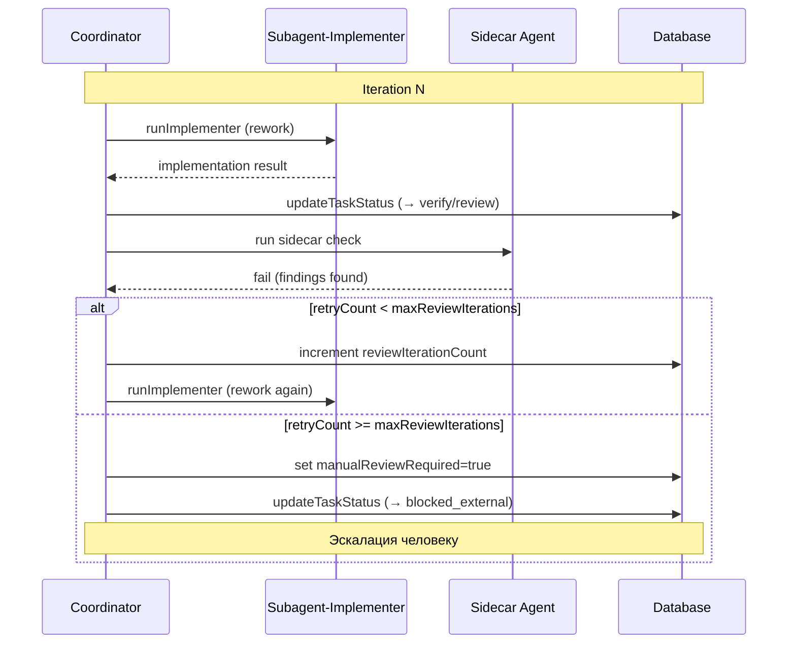

[← UC-pipeline.sidecar.review-with-sidecar-agent](UC-pipeline.sidecar.review-with-sidecar-agent.md) · [Back to README](README.md) · [UC-pipeline.independent-verification.verify-independently →](UC-pipeline.independent-verification.verify-independently.md)

# UC-pipeline.review-loop.iterate-review-feedback: Циклическое авторевью с итерациями доработки

**Актор:** Coordinator (Agent) → Pipeline Loop

**Приоритет:** P1

**Ключевая функция:** HF5.3 Автоматическое ревью с итерациями

**Канал:** Agent (coordinator, subagents)

**Описание:** При обнаружении проблем sidecar-агентом задача возвращается на доработку (implementing → verify/review). Цикл повторяется до прохождения всех гейтов или исчерпания лимита попыток `maxReviewIterations`.

**Диаграмма последовательности:**

**Основной поток:**

1. Sidecar-агент возвращает `fail` с набором finding-ов.
2. Coordinator проверяет `reviewIterationCount < maxReviewIterations`.
3. Coordinator возвращает задачу в `implementing` с `reworkRequested=true`.
4. При повторном запуске implementer получает finding-и и исправляет их.
5. Coordinator повторно запускает verify/review sidecar.
6. Цикл повторяется до прохождения или исчерпания попыток.

**Альтернативные потоки:**

- **A1. Лимит попыток исчерпан:** `manualReviewRequired=true` — задача переводится в `blocked_external` с диагностикой. Ожидает вмешательства человека.
- **A2. Промежуточное прохождение:** на любой итерации sidecar может вернуть `pass`, цикл завершается.
- **A3. Сброс счётчика:** при ручном вмешательстве человека `manualReviewRequired` может быть сброшен.

**Постусловия:** Задача либо прошла ревью (статус `done`), либо эскалирована человеку с диагностикой (`blocked_external`, `manualReviewRequired=true`).

**Источник требований:** HF5.3 Автоматическое ревью с итерациями, BR-trigger.automation.auto-review, BR-trigger.task-lifecycle.skip-review
