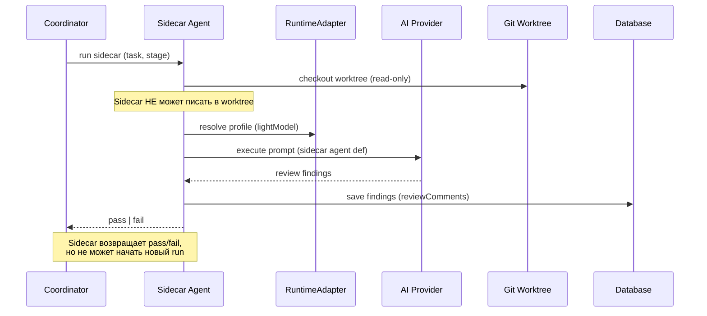

[← UC-pipeline.gate.enforce-stage-transition-gate](UC-pipeline.gate.enforce-stage-transition-gate.md) · [Back to README](../README.md) · [UC-pipeline.review-loop.iterate-review-feedback →](UC-pipeline.review-loop.iterate-review-feedback.md)

# UC-pipeline.sidecar.review-with-sidecar-agent: Sidecar-агенты (read-only) проверки результата

**Актор:** Coordinator (Agent) → Subagent-Reviewer / Subagent-Verifier

**Приоритет:** P0

**Ключевая функция:** HF5.2 Sidecar-агенты (read-only)

**Канал:** Agent (runtime adapter → AI-провайдер)

**Описание:** Sidecar-агенты (reviewer и verifier) запускаются в read-only режиме: они проверяют результат изменения, но не могут его модифицировать. Каждый sidecar использует изолированный runtime-профиль (часто lightweight-модель для экономии) и действует в рамках своих agent definitions.

**Диаграмма последовательности:**

**Основной поток:**

1. Coordinator запускает sidecar-агента для соответствующей стадии:
   - `verify` → verify-sidecar (верификация реализации).
   - `review` → review-sidecar (код-ревью).
2. Sidecar открывает Git worktree задачи в read-only режиме.
3. Sidecar разрешает runtime-профиль (обычно `lightModel` для экономии затрат).
4. Загружает agent definition sidecar-агента.
5. AI-провайдер выполняет проверку (read-only: анализ кода, сравнение с планом, поиск дефектов).
6. Sidecar сохраняет результаты (findings, comments) в БД.
7. Sidecar возвращает `pass | fail` Coordinator-у.

**Альтернативные потоки:**

- **A1. Sidecar не может запуститься:** ошибка runtime (rate_limit, auth) — Coordinator блокирует задачу.
- **A2. Результат fail:** Coordinator запускает цикл доработки (см. UC-pipeline.review-loop).
- **A3. Несколько Finding-ов:** sidecar сохраняет массив `AutoReviewFinding` с source (security, style, correctness).

**Постусловия:** Sidecar-агент завершил read-only проверку. Результат сохранён в БД. Задача либо переходит на следующую стадию, либо возвращается на доработку.

**Источник требований:** HF5.2 Sidecar-агенты (read-only), BR-automation.auto-review
