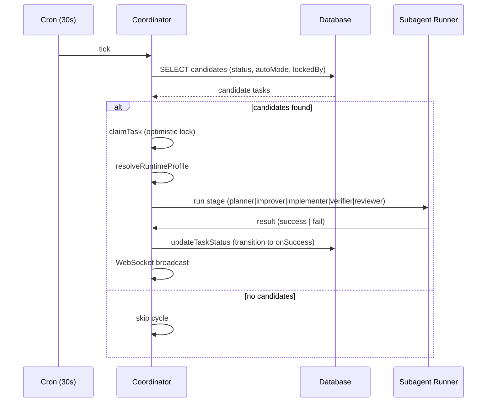

[← Back to USE-CASES-INDEX](USE-CASES-INDEX.md) · [Back to README](../README.md) · [UC-pipeline.plan.generate-change-plan →](UC-pipeline.plan.generate-change-plan.md)

# UC-pipeline.stage.auto-advance-task: Автоматическое прохождение стадий конвейера

**Актор:** Coordinator (Agent)

**Приоритет:** P0

**Ключевая функция:** HF1.1 Автоматическое прохождение стадий, HF5.1 Формальные гейты переходов

**Канал:** Agent (node-cron, 30s poll cycle)

**Описание:** Coordinator опрашивает БД каждые 30 секунд, выбирает задачи, готовые к переходу на следующую стадию, и запускает соответствующие субагенты. Система автоматически продвигает задачу по стадиям: backlog → planning → plan_review → implementing → verify → review → done.

**Диаграмма последовательности:**

**Основной поток:**

1. Каждые 30 секунд Coordinator активируется по сигналу node-cron и начинает poll-цикл.
2. Coordinator запрашивает из БД задачи, готовые к переходу: статус соответствует `from`, `autoMode=true`, не заблокированы (`blockedReason=null`), не заблокированы гейтом лимитов.
3. Для каждого кандидата Coordinator выполняет `claimTask` — оптимистичную блокировку (устанавливает `lockedBy=coordinatorId`, `lockedUntil`).
4. Coordinator разрешает Effective Runtime Profile для задачи (слияние профилей: задача → проект → система → окружение).
5. Coordinator запускает субагента, соответствующего стадии:
   - `planning` → `runPlanner` (plan-coordinator)
   - `improve` → `runImprover` (plan-improver)
   - `plan_review` → `runPlanChecker` / `runPlanReviewPublisher`
   - `implementing` → `runImplementer` (implement-coordinator)
   - `verify` → `runVerifier` (verify-sidecar)
   - `review` → `runReviewer` (review-sidecar)
6. Субагент выполняет работу через выбранный runtime-адаптер.
7. При успехе Coordinator применяет переход: `updateTaskStatus(taskId, patch)` со статусом `onSuccess`.
8. Coordinator освобождает блокировку (`releaseTaskClaim`).
9. Coordinator отправляет WebSocket-событие `task:stageChanged` для real-time обновления UI.

**Альтернативные потоки:**

- **A1. Runtime-гейт заблокировал задачу:** если лимит проекта превышен, Coordinator блокирует задачу (`blocked_external`) и планирует retry после reset-окна.
- **A2. Задача не захвачена:** другой Coordinator уже владеет задачей (`lockedBy ≠ null`), пропускаем.
- **A3. Ошибка выполнения:** субагент вернул ошибку; Coordinator устанавливает `blocked_external` с диагностикой и инкрементирует `retryCount`.
- **A4. Аварийное восстановление:** `releaseStaleTaskClaims` разблокирует задачи с истёкшим `lockedUntil` и отсутствующим хартбитом.

**Постусловия:** Задача переведена на следующую стадию конвейера; изменения доступны в UI через WebSocket-трансляцию; событие аудита `TaskStageChanged` записано.

**Источник требований:** HF1.1 Автоматическое прохождение стадий (`vision.md` §2.2), BR-automation.pipeline, BR-task-lifecycle.stages, BR-task-lifecycle.transitions
