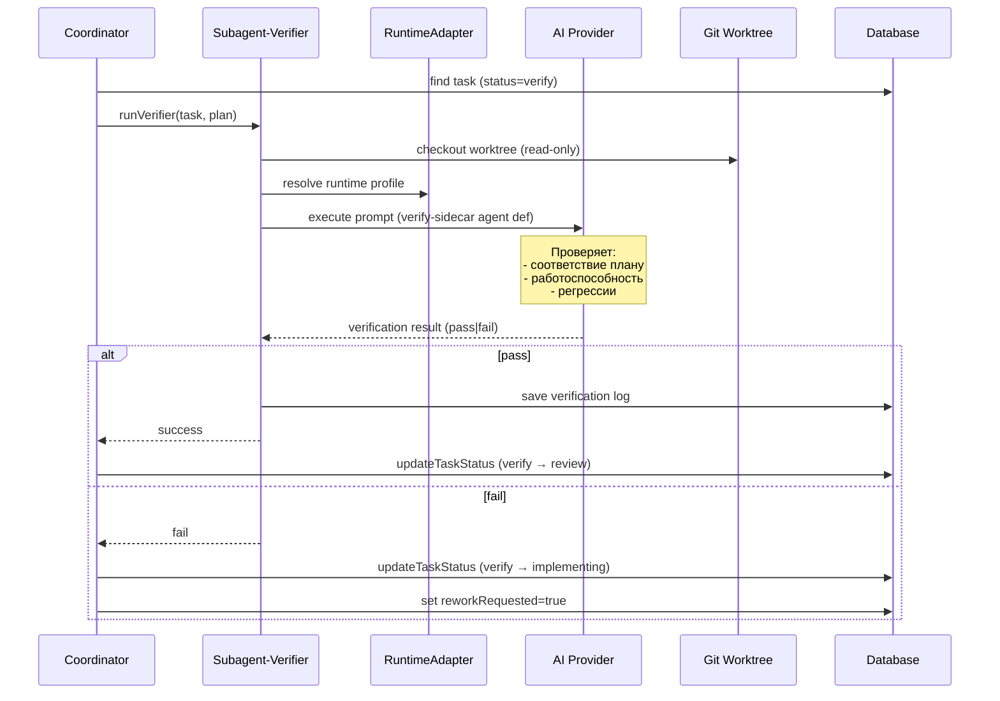

[← UC-pipeline.implementation.execute-change-in-isolation](UC-pipeline.implementation.execute-change-in-isolation.md) · [Back to README](../README.md) · [UC-pipeline.completion.auto-complete-pipeline →](UC-pipeline.completion.auto-complete-pipeline.md)

# UC-pipeline.verification.verify-change-result: Верификация результата изменения

**Актор:** Coordinator (Agent) → Subagent-Verifier

**Приоритет:** P1

**Ключевая функция:** HF1.5 Верификация результата, HF5.4 Независимая верификация

**Канал:** Agent (runtime adapter → AI-провайдер)

**Описание:** Coordinator запускает верификатора (verify-sidecar) для задачи в статусе `verify`. Верификатор независимо (read-only) проверяет реализованное изменение на соответствие плану, работоспособность и отсутствие регрессий.

**Диаграмма последовательности:**

**Основной поток:**

1. Coordinator выбирает задачу в статусе `verify` и захватывает блокировку.
2. Coordinator запускает `runVerifier` — read-only sidecar-агент.
3. Верификатор открывает Git worktree задачи.
4. Загружает agent definition `verify-sidecar`.
5. AI-провайдер выполняет проверку: сравнивает реализацию с планом, проверяет синтаксис, структуру, запускает тесты (команды в worktree).
6. При успехе Coordinator переводит задачу в `review`.
7. При неудаче Coordinator возвращает задачу в `implementing` с `reworkRequested=true`.

**Альтернативные потоки:**

- **A1. Верификация не настроена:** если `runPostVerify=false`, задача переходит из `implementing` напрямую в `review` (для human-owner задач переход `submit_implementation` → `verify`).
- **A2. Множественные ошибки:** при превышении `maxReviewIterations` Coordinator эскалирует задачу (см. UC-pipeline.escalation).

**Постусловия:** Изменение либо прошло верификацию (статус `review`), либо возвращено на доработку (статус `implementing`, `reworkRequested=true`). Результат верификации сохранён.

**Источник требований:** HF1.5 Верификация результата, HF5.4 Независимая верификация, BR-trigger.automation.pipeline
