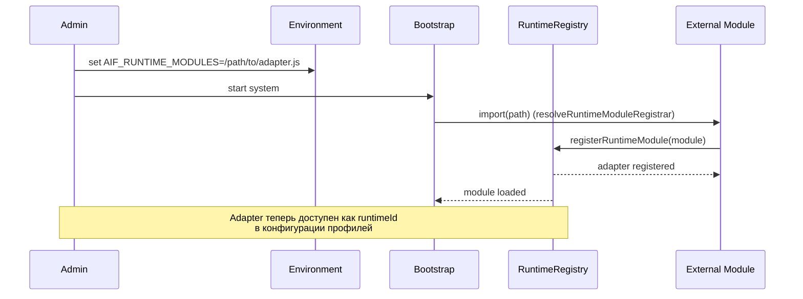

[← UC-runtime.override.override-profile-for-task](UC-runtime.override.override-profile-for-task.md) · [Back to README](../README.md) · [UC-vcs-auto.isolation.execute-task-in-worktree →](UC-vcs-auto.isolation.execute-task-in-worktree.md)

# UC-runtime.external-adapter.register-external-module: Подключение внешнего runtime-адаптера

**Актор:** Administrator

**Приоритет:** P2

**Ключевая функция:** HF3.3 Подключение внешних адаптеров

**Канал:** API (env var AIF_RUNTIME_MODULES)

**Описание:** Администратор подключает внешний runtime-адаптер через переменную окружения `AIF_RUNTIME_MODULES` без изменения кода системы. Модуль загружается динамически через `registerRuntimeModule` и регистрируется в `RuntimeRegistry`.

**Диаграмма последовательности:**

**Основной поток:**

1. Администратор устанавливает переменную окружения `AIF_RUNTIME_MODULES` с путём к модулю.
2. При старте системы `bootstrapRuntimeRegistry` вызывает `resolveRuntimeModuleRegistrar`.
3. Модуль импортируется динамически через `require()`.
4. Модуль вызывает `registerRuntimeModule(module)` с фабрикой адаптера, runtimeId, providerId, capabilities.
5. Адаптер регистрируется в `RuntimeRegistry` и становится доступным для выбора в runtime-профилях.
6. После успешной загрузки адаптер проходит провайдер-специфичную конфигурацию (resolve, validate).

**Альтернативные потоки:**

- **A1. Модуль не найден:** `RuntimeModuleLoadError` — система логирует ошибку и продолжает работу без модуля.
- **A2. Ошибка валидации:** `RuntimeModuleValidationError` — модуль загружен, но не соответствует контракту.
- **A3. Несколько модулей:** `AIF_RUNTIME_MODULES` поддерживает разделение путей через запятую.

**Постусловия:** Внешний адаптер зарегистрирован и доступен для создания runtime-профилей.

**Источник требований:** HF3.3 Подключение внешних адаптеров, BR-project.runtime-profiles
