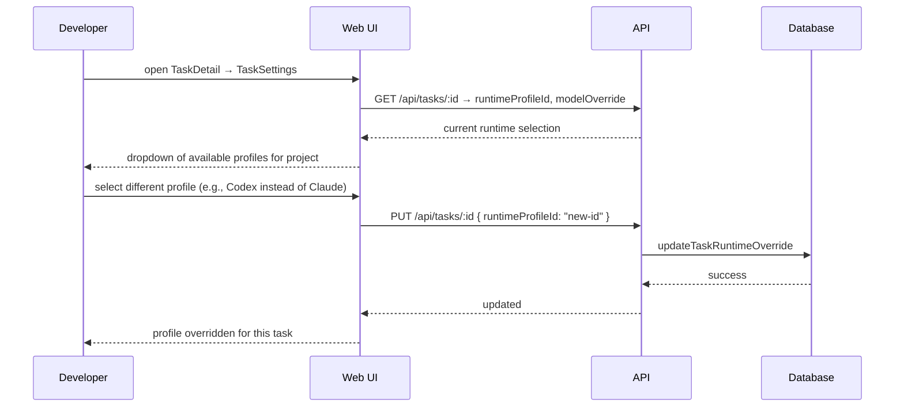

[← UC-runtime.profile.configure-project-runtime](UC-runtime.profile.configure-project-runtime.md) · [Back to README](../README.md) · [UC-runtime.external-adapter.register-external-module →](UC-runtime.external-adapter.register-external-module.md)

# UC-runtime.override.override-profile-for-task: Переопределение runtime-профиля для конкретной задачи

**Актор:** Developer

**Приоритет:** P1

**Ключевая функция:** HF3.2 Переопределение профиля для конкретного изменения

**Канал:** GUI (TaskSettings) / API (REST)

**Описание:** Разработчик переопределяет runtime-профиль для конкретной задачи, выбирая другого провайдера или модель. Переопределение действует только для этой задачи (каскадное разрешение: задача → проект → система).

**Диаграмма последовательности:**

**Основной поток:**

1. Пользователь открывает детальный просмотр задачи и переходит в TaskSettings.
2. UI показывает текущий Effective Runtime Profile (на основе cascade resolution).
3. Пользователь выбирает другой профиль из доступных.
4. API устанавливает `runtimeProfileId` на задаче.
5. Cascade resolution теперь использует: `runtimeProfileId` задачи → `default*RuntimeProfileId` проекта → системный дефолт.

**Альтернативные потоки:**

- **A1. Model override:** можно переопределить только модель (`modelOverride`), не меняя профиль.
- **A2. Сброс:** сброс `runtimeProfileId` в null возвращает к дефолту проекта.

**Постусловия:** Runtime-профиль задачи переопределён. При следующем запуске Coordinator использует указанный профиль.

**Источник требований:** HF3.2 Переопределение профиля для конкретного изменения, BR-project.runtime-profiles
