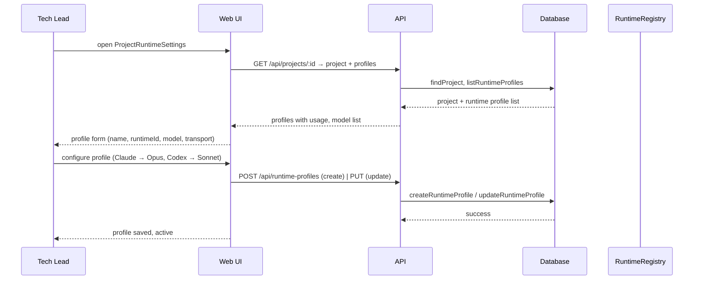

[← UC-dashboard.search.find-task-by-query](UC-dashboard.search.find-task-by-query.md) · [Back to README](../README.md) · [UC-runtime.override.override-profile-for-task →](UC-runtime.override.override-profile-for-task.md)

# UC-runtime.profile.configure-project-runtime: Настройка runtime-профиля для проекта

**Актор:** Tech Lead / Admin

**Приоритет:** P0

**Ключевая функция:** HF3.1 Настройка runtime-профиля для проекта

**Канал:** GUI (ProjectRuntimeSettings) / API (REST)

**Описание:** Администратор настраивает runtime-профили проекта: выбирает AI-провайдера для каждой стадии конвейера (планирование, реализация, ревью, чат). Runtime-профиль определяет, какой адаптер (Claude, Codex, OpenRouter, OpenCode) и какая модель используется для задач проекта.

**Диаграмма последовательности:**

**Основной поток:**

1. Пользователь с ролью `admin` открывает ProjectRuntimeSettings (через Header или иконку шестерёнки).
2. UI загружает список runtime-профилей проекта (`GET /api/runtime-profiles?projectId=X`).
3. Для каждого профиля отображаются: имя, runtimeId (claude/codex/opencode/openrouter), модель, транспорт (SDK/CLI/API/APP_SERVER), usage (токены, стоимость).
4. Пользователь создаёт/редактирует профиль: указывает `runtimeId`, `providerId`, `transport`, `baseUrl`, `defaultModel`, опциональные `headers` и `options`.
5. Профиль привязывается к стадиям проекта: `defaultTaskRuntimeProfileId`, `defaultPlanRuntimeProfileId`, `defaultReviewRuntimeProfileId`, `defaultChatRuntimeProfileId`.
6. При создании профиля APIKey указывается как переменная окружения (`apiKeyEnvVar`).

**Альтернативные потоки:**

- **A1. System defaults:** если для проекта не указан профиль, используется системный по умолчанию через `getAppDefaultRuntimeProfileId`.
- **A2. Глобальные профили:** профили без `projectId` доступны всем проектам через `listRuntimeProfiles(includeGlobal=true)`.
- **A3. Model Discovery:** UI может показать список доступных моделей через `createRuntimeModelDiscoveryService`.
- **A4. Внешние модули:** администратор подключает внешний адаптер через `AIF_RUNTIME_MODULES` env var.

**Постусловия:** Runtime-профиль сконфигурирован и доступен для выбора задачам проекта. Cascade resolution: задача → проект → система → окружение.

**Источник требований:** HF3.1 Настройка runtime-профиля для проекта, BR-project.runtime-profiles
