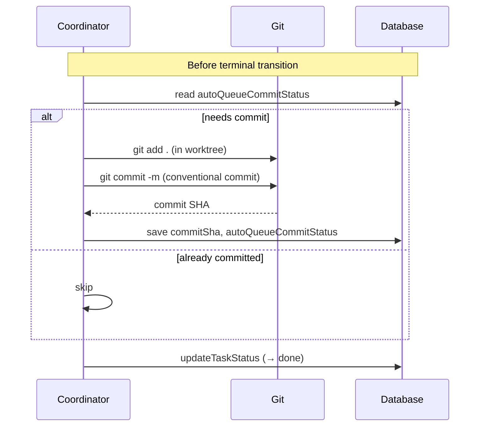

[← UC-vcs-auto.isolation.execute-task-in-worktree](UC-vcs-auto.isolation.execute-task-in-worktree.md) · [Back to README](../README.md) · [UC-vcs-auto.mr.publish-atomic-merge-request →](UC-vcs-auto.mr.publish-atomic-merge-request.md)

# UC-vcs-auto.commit.auto-commit-before-completion: Автоматический коммит изменений перед завершением

**Актор:** Coordinator (Agent)

**Приоритет:** P0

**Ключевая функция:** HF4.2 Автоматические коммиты

**Канал:** Agent (Git)

**Описание:** Перед переходом задачи в терминальную стадию (done → accepted) Coordinator выполняет auto-queue коммит всех изменений в worktree. Gate-коммит проверяет, что все изменения закоммичены, и при необходимости создаёт commit с сообщением по конвенциям проекта.

**Диаграмма последовательности:**

**Основной поток:**

1. Перед переходом задачи в `done` Coordinator вызывает `ensureCommitBeforeTerminalStatus`.
2. Проверяет `autoQueueCommitStatus` — если уже committed, пропускает.
3. Выполняет `git add .` и `git commit -m {message}`.
4. Сообщение коммита генерируется по конвенциям проекта (Conventional Commits, Gitmoji, и т.д.).
5. `commitSha` и `autoQueueCommitBaseSha` (текущая база) сохраняются в задаче.
6. При ошибке коммита задача блокируется с `blocked_external`.

**Альтернативные потоки:**

- **A1. Dirty worktree:** `scheduledTaskHasDirtyAutoQueueWorktree` — проверка, что нет незакоммиченных изменений от предыдущих задач.
- **A2. Plan Review commit:** отдельный gate (`planReviewCommit.ts`) — коммит плана перед публикацией PR/MR.

**Постусловия:** Все изменения закоммичены в ветку задачи. `commitSha` сохранён.

**Источник требований:** HF4.2 Автоматические коммиты, BR-constraint.git.commit-conventions, BR-trigger.automation.completion-commit, BR-inference.git.convention-resolution
