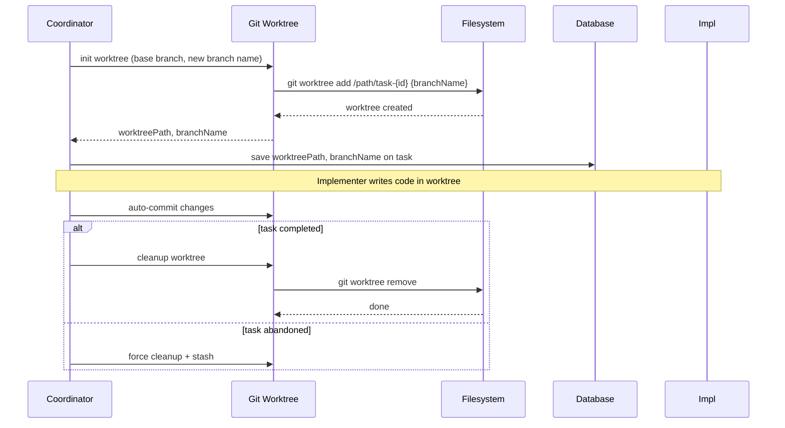

[← UC-runtime.external-adapter.register-external-module](UC-runtime.external-adapter.register-external-module.md) · [Back to README](../README.md) · [UC-vcs-auto.commit.auto-commit-before-completion →](UC-vcs-auto.commit.auto-commit-before-completion.md)

# UC-vcs-auto.isolation.execute-task-in-worktree: Изолированное выполнение задачи в Git worktree

**Актор:** Coordinator (Agent)

**Приоритет:** P0

**Ключевая функция:** HF4.1 Изолированное выполнение

**Канал:** Agent (Git worktree)

**Описание:** Coordinator создаёт изолированный Git worktree для каждой задачи: отдельная ветка от base branch, собственное рабочее дерево. Параллельные задачи не создают конфликтов. Worktree очищается при завершении задачи.

**Диаграмма последовательности:**

**Основной поток:**

1. Coordinator определяет `branchName` на основе project conventions и taskId.
2. Coordinator создаёт Git worktree: `git worktree add {worktreePath} {baseBranch}`.
3. В worktree создаётся новая ветка от base branch.
4. `worktreePath` и `branchName` сохраняются в БД на задаче.
5. Subagent-Implementer работает внутри worktree (изолирован от других задач).
6. По завершении задачи (done + accepted) Coordinator очищает worktree.

**Альтернативные потоки:**

- **A1. Serial execution:** для проектов с `parallelEnabled=false` используется общая ветка и последовательное выполнение.
- **A2. AutoQueue shared worktree:** для autoQueue-проектов используется единый worktree с общим auto-queue коммитом.
- **A3. Stale worktree:** `worktreeReconcile.ts` и `worktreeLifecycle.ts` находят и очищают осиротевшие worktree-ы.
- **A4. Branchless fix:** `isFix=true` может использовать общую ветку с быстрым коммитом.

**Постусловия:** Worktree создан и изолирован. Путь и ветка сохранены. Worktree будет очищен при завершении задачи.

**Источник требований:** HF4.1 Изолированное выполнение, BR-git.worktree-isolation, BR-git.branch-naming
