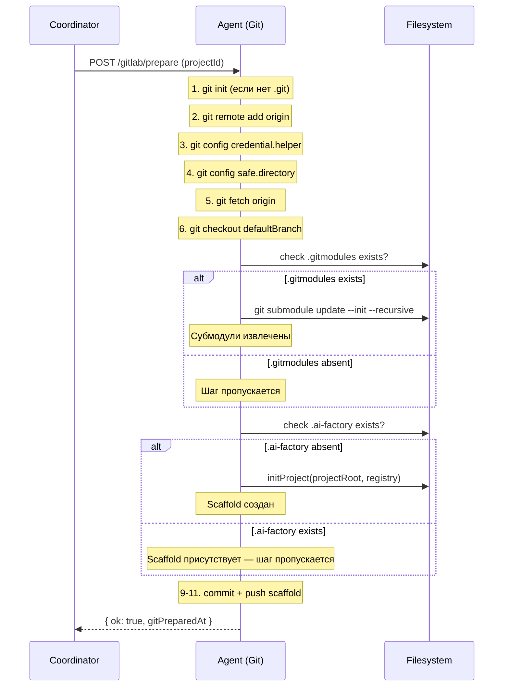

[← UC-vcs-auto.isolation.create-worktree](UC-vcs-auto.isolation.create-worktree.md) · [Back to README](../README.md) · [UC-vcs-auto.mr.publish-atomic-merge-request →](UC-vcs-auto.mr.publish-atomic-merge-request.md)

# UC-vcs-auto.isolation.init-submodules: Инициализация субмодулей при подготовке репозитория

**Актор:** Coordinator (Schedule) → Agent (Git)

**Приоритет:** P1

**Ключевая функция:** HF4.1 Изоляция и подготовка репозитория

**Канал:** Agent Internal API (HTTP)

**Описание:** При первом Sync now (git-prepare) после fetch и checkout дефолтной ветки агент инициализирует git-субмодули проекта. Это гарантирует, что рабочее дерево содержит полный код, включая внешние зависимости, связанные через субмодули.

**Диаграмма последовательности:**

**Основной поток:**

1. Coordinator запускает git-prepare через `POST /<provider>/prepare`.
2. Агент выполняет последовательность git-операций: init, remote, credential helper, safe.directory, fetch, checkout.
3. После checkout агент проверяет наличие `.gitmodules` в корне проекта.
4. Если `.gitmodules` существует — выполняется `git submodule update --init --recursive`.
5. Агент логирует результат инициализации.
6. Prepare продолжается с AI Factory scaffold init: если `.ai-factory/` отсутствует — выполняется `initProject`; если присутствует — шаг пропускается.

**Альтернативные потоки:**

- **A1. Нет субмодулей:** `.gitmodules` отсутствует — шаг инициализации пропускается.
- **A2. Ошибка инициализации:** Недоступен remote URL субмодуля, ошибка аутентификации — prepare возвращает `422` с кодом `{provider}_prepare_submodule_failed`, синхронизация блокируется.
- **A3. Sync now с уже инициализированными субмодулями:** Повторный вызов prepare (gitPreparedAt != null) не запускает prepare — субмодули остаются в текущем состоянии.
- **A4. GitHub provider:** Аналогичный поток через `POST /github/prepare` с тем же шагом инициализации субмодулей.
- **A5. AI Factory scaffold уже существует:** `.ai-factory/` присутствует в корне проекта — шаг инициализации scaffold пропускается (idempotent). Файлы конфигурации и кастомные скиллы не перезаписываются.
- **A6. Ошибка инициализации scaffold:** Runtime registry недоступен или запись файлов scaffold не удалась — prepare возвращает `422` с кодом `{provider}_prepare_init_failed`, синхронизация блокируется (через `init_failed`).

**Постусловия:** Субмодули проекта инициализированы — рабочее дерево полно.

**Источник требований:** HF4.1 Изоляция и подготовка репозитория, BR-constraint.git.submodule-init
