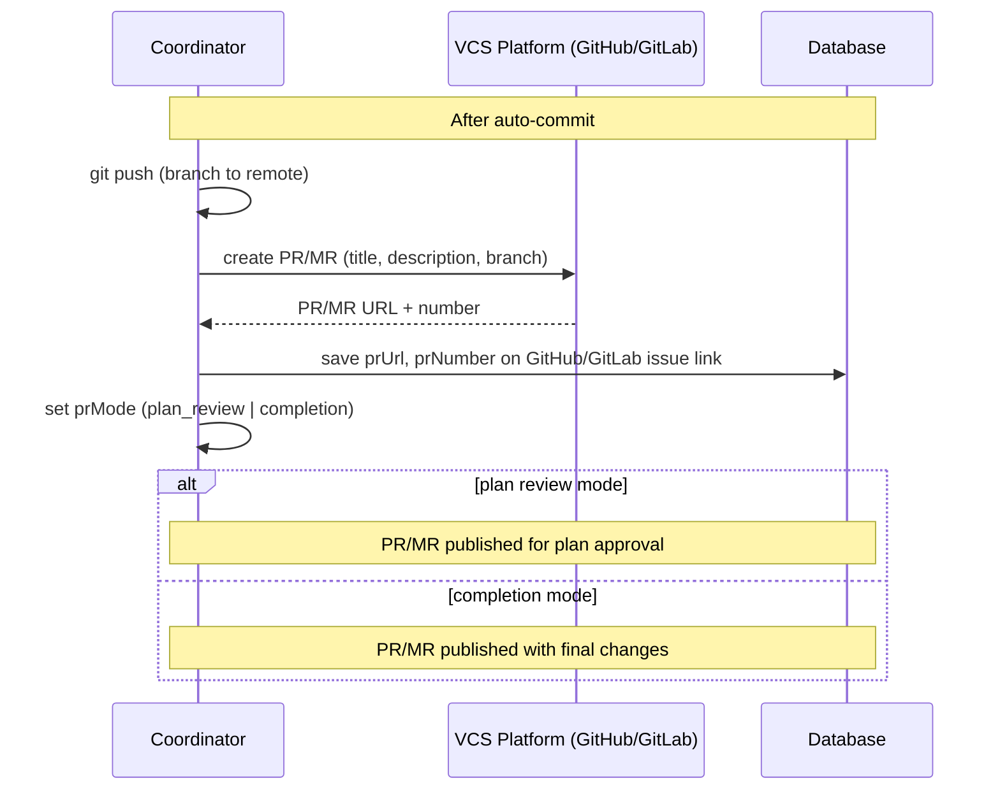

[← UC-vcs-auto.commit.auto-commit-before-completion](UC-vcs-auto.commit.auto-commit-before-completion.md) · [Back to README](../README.md) · [UC-vcs-auto.plan-review.publish-plan-for-approval →](UC-vcs-auto.plan-review.publish-plan-for-approval.md)

# UC-vcs-auto.mr.publish-atomic-merge-request: Создание единого atomic MR/PR

**Актор:** Coordinator (Agent)

**Приоритет:** P2

**Ключевая функция:** HF4.3 Единый atomic MR

**Канал:** Agent (Git push + VCS API)

**Описание:** Coordinator создаёт единый Merge Request / Pull Request на GitHub или GitLab, объединяющий все изменения задачи в одну ветку. MR публикуется с описанием и связью с Issue. Включает plan review gate при необходимости.

**Диаграмма последовательности:**

**Основной поток:**

1. После auto-commit Coordinator выполняет `git push` ветки задачи в remote.
2. Coordinator создаёт PR/MR через REST API GitHub/GitLab.
3. PR/MR включает: заголовок (название задачи), описание (Change Plan summary), assignees.
4. Для задач с `planReviewState=published` PR/MR публикуется в режиме plan review (ожидание approval).
5. Ссылка на PR/MR сохраняется в БД.

**Альтернативные потоки:**

- **A1. Plan Review Gate:** `planReviewPublisher.ts` создаёт PR/MR с планом и ждёт approval перед реализацией.
- **A2. VCS недоступен:** ошибка синхронизации — задача блокируется.

**Постусловия:** MR/PR опубликован на VCS-платформе. Ссылки сохранены.

**Источник требований:** HF4.3 Единый atomic MR, BR-git.vcs-workflow
