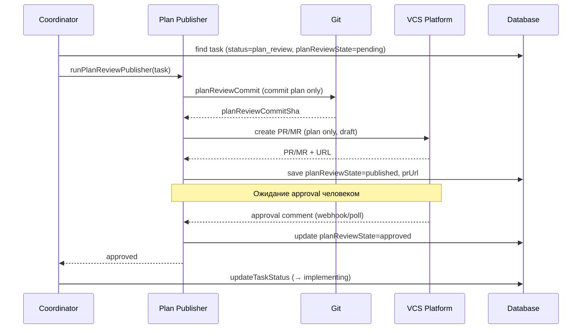

[← UC-vcs-auto.mr.publish-atomic-merge-request](UC-vcs-auto.mr.publish-atomic-merge-request.md) · [Back to README](../README.md) · [UC-accounting.tracking.record-runtime-call →](UC-accounting.tracking.record-runtime-call.md)

# UC-vcs-auto.plan-review.publish-plan-for-approval: Публикация плана для утверждения (Plan Review Gate)

**Актор:** Coordinator (Agent) → Plan Publisher

**Приоритет:** P1

**Ключевая функция:** HF4.4 Plan Review Gate

**Канал:** Agent (Git + VCS API)

**Описание:** Coordinator публикует Change Plan задачи как отдельный commit + PR/MR для утверждения человеком. Plan Review Gate встраивается между `plan_review` и `implementing`: задача ждёт approval или feedback через VCS-интерфейс.

**Диаграмма последовательности:**

**Основной поток:**

1. Coordinator обнаруживает задачу с `planReviewState=pending` в статусе `plan_review`.
2. Coordinator запускает `runPlanReviewPublisher`.
3. `planReviewCommit.ts` создаёт commit только с планом (без кода реализации).
4. `planReviewPublisher.ts` пушит ветку и создаёт PR/MR в Draft-режиме (WIP).
5. Сохраняется `planReviewPublishedAt`, `planReviewCommitSha`.
6. Coordinator ожидает: Plan Review Gate проверяет `planReviewState` на каждом poll-цикле.
7. При `planReviewState=approved` (через UI или VCS-webhook) задача переходит в `implementing`.
8. При `planReviewState=changes_requested` задача возвращается в `planning`/`improve`.

**Альтернативные потоки:**

- **A1. Plan Review не настроен:** `planReviewState=null` — задача переходит в `implementing` без gate.
- **A2. Feedback:** reviewer оставляет комментарии в PR/MR; `planReviewFeedback` сохраняется.
- **A3. Автоматическое утверждение:** `plan_review` с гейтом может быть сконфигурирован как "approve after N minutes".

**Постусловия:** Plan опубликован. Задача ждёт утверждения перед реализацией. После утверждения продолжает конвейер.

**Источник требований:** HF4.4 Plan Review Gate, BR-automation.plan-review-gate, BR-git.vcs-workflow
