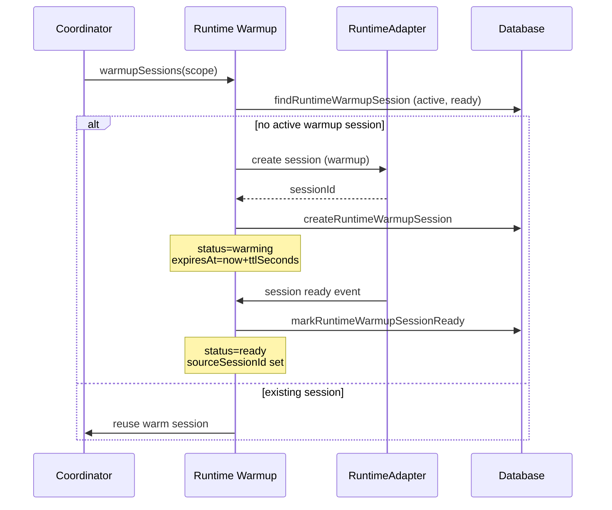

[← UC-integration.ci-status.check-pipeline-status](UC-integration.ci-status.check-pipeline-status.md) · [Back to README](../README.md)

# UC-warmup.preheat.warmup-runtime-session: Предварительный разогрев сессий runtime

**Актор:** Coordinator (Schedule) → Runtime Warmup

**Приоритет:** P2

**Ключевая функция:** HF12.1 Предварительный прогрев сессий

**Канал:** Schedule (cron)

**Описание:** Coordinator периодически создаёт и прогревает сессии runtime (RuntimeWarmupSession) для проектов. Прогретая сессия готова к использованию: при старте задачи Coordinator может переиспользовать существующую сессию вместо создания новой, сокращая время старта.

**Диаграмма последовательности:**

**Основной поток:**

1. Coordinator запускает warmup-цикл для проектов с настроенными runtime-профилями.
2. Warmup проверяет наличие активной сессии (`status=ready`, не истекла).
3. Если сессии нет — создаёт новую через runtime-адаптер.
4. Сессия прогревается и отмечается как `ready` с `expiresAt`.
5. При старте задачи Coordinator может переиспользовать готовую сессию.

**Альтернативные потоки:**

- **A1. Warming timeout:** если сессия не прогрелась за TTL, `markRuntimeWarmupSessionFailed`.
- **A2. Stale sessions:** `expireStaleRuntimeWarmupSessions` — очистка истёкших сессий.
- **A3. Scope:** `findRuntimeWarmupSession` фильтрует по projectId, runtimeProfileId, model.

**Постусловия:** Прогретая runtime-сессия доступна для переиспользования. Старые сессии очищены.

**Источник требований:** HF12.1 Предварительный прогрев сессий
