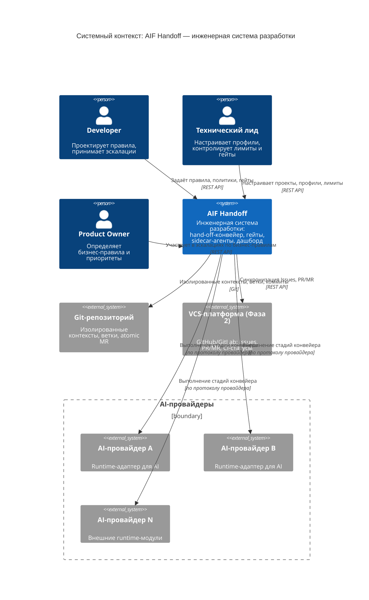

# Документ о концепции и границах проекта: AIF Handoff — система автономного управления задачами

**AIF Handoff** — инженерная система разработки, в которой AI является исполняющим контуром. Изменение проходит через hand-off-конвейер стадий (планирование → реализация → проверки → эскалация → merge), каждая из которых обрабатывается специализированным агентом. Результат — согласованный change set, переводящий проект из одного непротиворечивого состояния в другое.

_Человек проектирует систему и принимает решения вне правил. Машина берёт на себя повторяемую работу: распространение изменений, реализацию, тестирование и проверку._

### Название продукта

**AIF Handoff** (Handoff) — инженерная система разработки, построенная как модульный монолит. **Handoff** — действующее наименование продукта (см. `docs/glossary.md`, раздел «AIF Handoff»). Система состоит из слоя общих контрактов, подключаемых runtime-адаптеров, централизованного слоя данных, API-сервера, веб-интерфейса и координатора с сабагентами. Название едино для API, UI, документации и интеграций.

---

## 1. Бизнес-требования

### 1.1. Исходные данные и постановка бизнес-проблемы

> **Пользовательская история.** Я, как разработчик или технический лид, хочу, чтобы изменение проходило по конвейеру от Issue до доверенного изменения без ручного контроля каждого шага — мне нужно только спроектировать систему, задать правила и принять решения, которые нельзя автоматизировать.

**Стратегическая цель.** Построить инженерную систему разработки, в которой передача ответственности между стадиями конвейера формализована, а не зависит от ручной передачи знаний между людьми. Handoff позволит команде быстро получать изменения, которым можно доверять, — за счёт автоматизации повторяемой работы и формальных гейтов на каждом переходе.

Сегодня разработка обычно проходит через цепочку: **требование → анализ → разработка → тестирование → документация**. На каждом переходе человек заново разбирается, что было решено раньше. Часть знаний — в документации, часть — в коде, часть — в тестах, часть — только в головах участников. В результате требования расходятся с кодом, тесты не соответствуют требованиям, документация устаревает, изменения не распространяются на зависимые артефакты.

Ключевые проблемы:

| ID     | Проблема                                                                                                                                                                                            | Последствие                                                                                                          |
| ------ | --------------------------------------------------------------------------------------------------------------------------------------------------------------------------------------------------- | -------------------------------------------------------------------------------------------------------------------- |
| **P1** | **Ручная передача знаний между стадиями.** Каждый переход — потеря контекста: планировщик не знает, что решил аналитик, реализатор — что задумал планировщик.                                       | Требования расходятся с кодом, документация устаревает, качество зависит от внимательности человека на каждом этапе. |
| **P2** | **Нет единого конвейера — разрозненные инструменты.** Разработчики используют AI-инструменты вразнобой, без формального hand-off между стадиями.                                                    | Контекст теряется, качество непредсказуемо, нет прозрачности.                                                        |
| **P3** | **Отсутствие прозрачности состояния изменения.** Непонятно, на какой стадии изменение, что уже сделано, какие решения приняты, какие гейты пройдены.                                                | Невозможность отслеживать прогресс и вмешиваться своевременно.                                                       |
| **P4** | **Отсутствие формальных гейтов — качество не гарантировано.** Нет детерминированных условий перехода между стадиями; результат зависит от того, насколько внимательно человек проверил каждый этап. | Незавершённая работа просачивается дальше, дефекты накапливаются.                                                    |
| **P5** | **Ручное управление git-ветками и VCS.** Создание веток, коммиты, PR/MR — ручные операции, отвлекающие от содержательной работы.                                                                    | Дополнительные трудозатраты, ошибки при работе с VCS.                                                                |
| **P6** | **Нет независимой проверки.** Тот, кто пишет код, его же и проверяет — контроль перестаёт быть независимым.                                                                                         | Пропуск дефектов, которые заметил бы свежий взгляд.                                                                  |
| **P7** | **Непредсказуемые затраты на AI-провайдеров.** Нет учёта использования, нет лимитов, нет контроля бюджета на уровне проекта или команды.                                                            | Перерасход, невозможность планировать бюджет.                                                                        |
| **P8** | **Привязка к одному AI-провайдеру.** Vendor lock-in и единая точка отказа при недоступности провайдера.                                                                                             | Риск остановки конвейера, отсутствие конкурентного ценообразования.                                                  |

**Итоговая бизнес-проблема:**

> **Когда каждое изменение требует ручной передачи знаний между стадиями, а AI-инструменты используются разрозненно, без формального конвейера, гейтов и независимых проверок — команда тратит время на механическую работу вместо содержательной, качество непредсказуемо, а автоматизация не приближает нас к доверенным изменениям.**

### 1.2. Возможности бизнеса

Внедрение AIF Handoff как инженерной системы разработки позволит:

- **Для разработчика:** Проектировать правила и политики, по которым агенты выполняют изменения. Не делать вручную то, что машина уже умеет делать правильно. Вмешиваться только там, где требуется инженерное решение или новое правило.
- **Для технического лида:** Наблюдать за прогрессом изменений через единый дашборд, контролировать прохождение гейтов, управлять runtime-профилями команд. Эскалации — не сбой, а сигнал, где не хватает правила.
- **Для команды:** Получать доверенные изменения быстрее: агенты работают параллельно, гейты проверяют формально, независимая верификация подтверждает результат. Прозрачность каждой стадии.
- **Для бизнеса:** Сократить time-to-market за счёт автоматизации повторяемой работы. Предсказуемые затраты на AI-провайдеров. Независимость от одного провайдера через подключаемые адаптеры.
- **Для организации:** Каждая эскалация превращается в новое правило — система разработки постепенно становится более автономной, повторяющиеся проблемы перестают требовать человека.

### 1.3. Бизнес-цели — SMART

| ID     | Бизнес-цель                                                            | SMART-декомпозиция                                                                                                                                                                                                                                                                                                                                                                                                                                                              | Какие проблемы решает |
| ------ | ---------------------------------------------------------------------- | ------------------------------------------------------------------------------------------------------------------------------------------------------------------------------------------------------------------------------------------------------------------------------------------------------------------------------------------------------------------------------------------------------------------------------------------------------------------------------- | --------------------- |
| **G1** | Автоматизировать hand-off-конвейер от Issue до доверенного изменения   | **S**: Изменение проходит по конвейеру стадий (планирование → реализация → проверки → merge) без ручного контроля каждого шага — агенты выполняют, гейты проверяют, человек подключается только в точках эскалации и решений вне правил. **M**: Доля изменений, прошедших конвейер без вмешательства человека на стадиях реализации и проверок [TBD-VM1]. **A**: Hand-off-конвейер, формальные гейты, сабагенты, runtime-адаптеры. **R**: P1, P2. **T**: [TBD-VT1]. | P1, P2                |
| **G2** | Обеспечить прозрачность состояния каждого изменения в реальном времени | **S**: Статус, план, пройденные гейты и результат каждого изменения отображаются в едином интерфейсе и обновляются в реальном времени. **M**: 100% изменений имеют актуальный статус; задержка обновлений — не более нескольких секунд [TBD-VM2]. **A**: Единый дашборд изменений, механизм рассылки событий. **R**: P3. **T**: непрерывно.                                                                                                                         | P3                    |
| **G3** | Обеспечить формальные гейты как условия перехода между стадиями        | **S**: Каждый переход между стадиями защищён формальным гейтом; непройденный гейт блокирует переход и возвращает изменение на доработку с эскалацией при исчерпании попыток. **M**: 100% стадий имеют формальный гейт; ноль изменений просачиваются через непройденный гейт [TBD-VM3]. **A**: Quality Gates, sidecar-агенты, independent verification. **R**: P4. **T**: [TBD-VT3].                                                                                 | P4                    |
| **G4** | Автоматизировать VCS-операции (ветки, коммиты, PR/MR)                  | **S**: Создание ветки, коммиты, публикация PR/MR выполняются агентами автоматически; результат — единый atomic MR, содержащий все изменения одного Issue. **M**: Доля изменений с автоматическими VCS-операциями [TBD-VM4]. **A**: Git-инфраструктура конвейера, atomic MR, gate коммита. **R**: P5. **T**: [TBD-VT4].                                                                                                                                              | P5                    |
| **G5** | Обеспечить независимую проверку каждого изменения                      | **S**: Каждое изменение проверяется read-only sidecar-агентами и независимой верификацией; проверяющий не может править проверяемый результат. **M**: 100% изменений проходят независимую проверку перед merge [TBD-VM5]. **A**: Sidecar-агенты (read-only), independent verification, gate ревью. **R**: P6. **T**: [TBD-VT5].                                                                                                                                     | P6                    |
| **G6** | Обеспечить учёт и лимитирование использования AI-провайдеров           | **S**: Каждый вызов runtime-адаптера учитывается; на уровне проекта или команды настроены лимиты; при превышении — блокировка с эскалацией. **M**: 100% вызовов учитываются; лимиты применяются [TBD-VM6]. **A**: Система учёта использования, лимиты runtime. **R**: P7. **T**: [TBD-VT6].                                                                                                                                                                         | P7                    |
| **G7** | Обеспечить провайдер-независимость через подключаемые runtime-адаптеры | **S**: Система поддерживает несколько runtime-адаптеров (различные AI-провайдеры) с переключением на уровне runtime-профиля. **M**: Не менее 2 различных runtime-адаптеров доступны одновременно [TBD-VM7]. **A**: Runtime-адаптеры, реестр, профили, модульный загрузчик. **R**: P8. **T**: [TBD-VT7].                                                                                                                                                             | P8                    |

### 1.4. Критерии успеха

Критерии сформулированы проверяемо — для каждого указан измеримый способ проверки. Значения, помеченные `TBD-VM*`, уточняются владельцем продукта.

| Цель                         | Критерий успеха                                                                     | Способ проверки                                                                        |
| ---------------------------- | ----------------------------------------------------------------------------------- | -------------------------------------------------------------------------------------- |
| G1 — Hand-off-конвейер       | Изменения проходят стадии без ручного контроля каждого шага                         | Доля изменений без вмешательства человека на стадиях реализации и проверок — `TBD-VM1` |
| G2 — Прозрачность            | Статус каждого изменения виден в реальном времени                                   | Проверка актуальности статуса на дашборде; задержка обновлений — `TBD-VM2`             |
| G3 — Формальные гейты        | Все переходы защищены гейтами; непройденные — блокируют                             | Ноль изменений, просочившихся через непройденный гейт — `TBD-VM3`                      |
| G4 — VCS-автоматизация       | VCS-операции выполняются автоматически, результат — atomic MR                       | Доля изменений с автоматическими VCS-операциями — `TBD-VM4`                            |
| G5 — Независимая проверка    | Все изменения проверены read-only проверяющими                                      | 100% изменений с независимой проверкой — `TBD-VM5`                                     |
| G6 — Учёт и лимиты           | Все вызовы runtime учитываются; лимиты применяются                                  | Полнота учёта; проверка блокировки при превышении лимита — `TBD-VM6`                   |
| G7 — Провайдер-независимость | Два и более runtime-адаптера доступны одновременно                                  | Интеграционный тест с переключением между адаптерами — `TBD-VM7`                       |
| G1+G2+G4 — Полный контур     | Изменение проходит от Issue до merge по формальному конвейеру с прозрачным статусом | Сквозной сценарий проходит интеграционный тест                                         |

#### Критерии приёмки (DoD)

| ID  | Критерий приёмки                                                 | Способ проверки                                                             |
| --- | ---------------------------------------------------------------- | --------------------------------------------------------------------------- |
| D1  | Изменение проходит все стадии конвейера от планирования до merge | E2E-тест: создание Issue, ожидание прохождения конвейера, проверка merge    |
| D2  | Гейты формально блокируют непройденные переходы                  | Тест: намеренно создать нарушение — гейт должен заблокировать переход       |
| D3  | Sidecar-агенты проверяют read-only и не могут править результат  | Тест: попытка изменения проверяющим агентом должна быть заблокирована       |
| D4  | Эскалация агента возвращает проблему с диагностикой              | Проверка: при тупике агент формирует отчёт с ожиданием, фактом и гипотезами |
| D5  | Есть актуальная документация по использованию                    | Документация по использованию опубликована и актуальна                      |

### 1.5. Положение о концепции

> **Для** разработчиков и технических лидов,
> **которые** сегодня вынуждены вручную передавать знания между стадиями разработки, контролировать каждый шаг и тратить время на механическую работу вместо содержательной,
> **AIF Handoff**
> **является** инженерной системой разработки, в которой AI является исполняющим контуром,
> **которая** (1) проводит изменение через hand-off-конвейер стадий (планирование → реализация → формальные гейты → независимая проверка → atomic MR), (2) использует семантический граф артефактов для анализа влияния и планирования, (3) применяет формальные гейты как условия перехода — непройденный гейт блокирует переход и возвращает на доработку, (4) обеспечивает независимую проверку каждого изменения (sidecar-агенты read-only + независимая верификация), (5) автоматизирует VCS-операции — ветки, коммиты, atomic MR, (6) ведёт учёт использования runtime-провайдеров с лимитами, (7) транслирует статус каждого изменения в реальном времени и (8) превращает каждую эскалацию в новое правило — конвейер становится автономнее,
> **в отличие от** разрозненных AI-инструментов, где нет формального hand-off, гейтов, независимой проверки и механизма обучения системы, а качество зависит от внимательности человека на каждом этапе,
> **наш продукт** — инженерная система разработки, построенная как модульный монолит, интегрирующая несколько runtime-адаптеров (различных AI-провайдеров): расширяемая, провайдер-независимая и спроектированная так, что человек проектирует систему и принимает решения вне правил, а машина исполняет повторяемую работу.

---

## 2. Рамки и ограничения проекта

### 2.1. Основные функции (по приоритету полезности)

| Приоритет | Функция                                       | Для чего нужна                                                                                                                             | Какую пользу приносит                                                                  |
| --------- | --------------------------------------------- | ------------------------------------------------------------------------------------------------------------------------------------------ | -------------------------------------------------------------------------------------- |
| **1**     | **HF1. Hand-off-конвейер**                    | Изменение проходит формальные стадии: планирование → реализация → проверки → merge; каждый переход защищён гейтом.                         | Разработчик не контролирует каждый шаг — конвейер гарантирует качество перехода.       |
| **2**     | **HF2. Единый дашборд изменений**             | Визуальное отображение всех изменений проекта со статусом прохождения стадий и гейтов.                                                     | Прозрачность состояния каждого изменения; ручное управление в точках эскалации.        |
| **3**     | **HF3. Подключаемые runtime-адаптеры**        | Разные AI-провайдеры работают через единый контракт; переключение на уровне профиля.                                                       | Провайдер-независимость; конкурентное ценообразование.                                 |
| **4**     | **HF4. VCS-автоматизация**                    | Автоматические ветки, коммиты, atomic MR; изоляция изменений между параллельными задачами.                                                 | Параллельное выполнение без конфликтов; автоматизация VCS-операций.                    |
| **5**     | **HF5. Quality Gates и независимая проверка** | Формальные гейты на каждом переходе; sidecar-агенты (read-only) + независимая верификация.                                                 | Качество гарантировано формально; проверяющий не может править результат.              |
| **6**     | **HF6. Учёт использования и лимиты**          | Сбор событий использования каждого вызова; лимиты с блокировкой при превышении.                                                            | Предсказуемые затраты на AI-провайдеров; контроль бюджета.                             |
| **7**     | **HF7. Роли, handoff-передача и эскалация**   | Формальные роли (Developer, PO, TL, QA-инженер) с границами ответственности; эскалация решений вне правил.                                 | Каждое решение принимает тот, кто владеет правилом; эскалация учит систему.            |
| **8**     | **HF8. Чат с AI-ассистентом**                 | Диалог с AI в контексте проекта или изменения для консультации без запуска конвейера.                                                      | Уточнение требований и получение рекомендаций в реальном времени.                      |
| **9**     | **HF9. Участники и аутентификация**           | Регистрация участников, разграничение прав по ролям.                                                                                       | Безопасный многопользовательский доступ.                                               |
| **10**    | **HF10. Аудит и наблюдаемость**               | Иммутабельные события аудита, хартбиты, категоризация ошибок; сквозная телеметрия исполнения на OpenTelemetry (предложено, HF10.4–HF10.6). | Полная прослеживаемость действий; диагностика сбоев по единой коррелированной картине. |
| **11**    | **HF11. VCS-интеграция (GitHub/GitLab)**      | Синхронизация с внешними VCS: Issues, PR/MR, CI-статусы.                                                                                   | Интеграция с существующим VCS-процессом команды.                                       |
| **12**    | **HF12. Разогрев сессий (Warmup)**            | Предварительное создание и прогрев сессий runtime.                                                                                         | Ускорение начала выполнения — сессии уже готовы.                                       |

### 2.2. Декомпозиция функций на 2 уровня

> **Принцип.** Каждая функция уровня 2 — результат, ценный для пользователя (роли из раздела 3.1), а не технический механизм. Каждая функция сформулирована как пользовательская история (US).

#### Уровень 1 — Ключевые бизнес-функции

| ID       | Функция                              | Соответствие бизнес-цели | Описание                                                                                                                             |
| -------- | ------------------------------------ | ------------------------ | ------------------------------------------------------------------------------------------------------------------------------------ |
| **HF1**  | Hand-off-конвейер                    | G1                       | Формальная передача изменения между стадиями: планирование → реализация → гейты → независимая проверка → atomic MR → merge           |
| **HF2**  | Единый дашборд изменений             | G2                       | Визуализация изменений со статусами, гейтами, возможностью ручного управления в точках эскалации                                     |
| **HF3**  | Подключаемые runtime-адаптеры        | G7                       | Единый контракт для разных AI-провайдеров; переключение на уровне профиля проекта или задачи                                         |
| **HF4**  | VCS-автоматизация                    | G3, G4                   | Изолированные ветки, автоматические коммиты, gate коммита, atomic MR                                                                 |
| **HF5**  | Quality Gates и независимая проверка | G5                       | Формальные гейты переходов; read-only sidecar-агенты; независимая верификация                                                        |
| **HF6**  | Учёт использования и лимиты          | G6                       | Сбор событий использования, лимиты, блокировка при превышении                                                                        |
| **HF7**  | Роли, handoff и эскалация            | G1 (гибкость)            | Формальные роли с границами ответственности; эскалация решений вне правил                                                            |
| **HF8**  | Чат с AI-ассистентом                 | G1 (коммуникация)        | Диалог с AI в контексте проекта или изменения                                                                                        |
| **HF9**  | Участники и аутентификация           | G2 (безопасность)        | Регистрация, роли, сессии, разрешения                                                                                                |
| **HF10** | Аудит и наблюдаемость                | G2 (контроль)            | Иммутабельный аудит, хартбиты, категоризация ошибок; сбор и хранение телеметрии исполнения на OpenTelemetry и AI-разбор (предложено) |
| **HF11** | VCS-интеграция (GitHub/GitLab)       | G4                       | Синхронизация с Issues, PR/MR, CI-статусы                                                                                            |
| **HF12** | Разогрев сессий (Warmup)             | G1 (производительность)  | Предварительный прогрев сессий runtime для сокращения времени старта                                                                 |

#### Уровень 2 — Пользовательские функции (US/UC)

##### HF1. Hand-off-конвейер

| Код   | Функция (ценность для пользователя) | Роль        | Формулировка US                                                                                                                                                     |
| ----- | ----------------------------------- | ----------- | ------------------------------------------------------------------------------------------------------------------------------------------------------------------- |
| HF1.1 | Автоматическое прохождение стадий   | Разработчик | Как разработчик, я хочу, чтобы изменение автоматически проходило стадии конвейера от планирования до merge, чтобы мне не нужно было вручную управлять его движением |
| HF1.2 | Планирование изменения AI           | Разработчик | Как разработчик, я хочу, чтобы AI-планировщик анализировал влияние изменения и создавал Change Plan, чтобы я видел, что будет затронуто                             |
| HF1.3 | Уточнение плана (Improve)           | Разработчик | Как разработчик, я хочу, чтобы план автоматически проверялся на полноту и противоречия вторым проходом, чтобы повысить качество планирования                        |
| HF1.4 | Реализация изменения AI             | Разработчик | Как разработчик, я хочу, чтобы AI-реализатор выполнял изменение по утверждённому плану в изолированном контексте, чтобы я не тратил время на реализацию             |
| HF1.5 | Верификация результата              | Разработчик | Как разработчик, я хочу, чтобы результат проверялся на работоспособность, чтобы я получал уже проверенное изменение                                                 |
| HF1.6 | Завершение конвейера                | Разработчик | Как разработчик, я хочу, чтобы конвейер автоматически завершался после успешных проверок, чтобы изменение попадало в merge без моего участия                        |
| HF1.7 | Ручное управление движением         | Разработчик | Как разработчик, я хочу иметь возможность вручную вмешаться в движение изменения, чтобы принять решение в нетиповой ситуации                                        |

##### HF2. Единый дашборд изменений

| Код   | Функция (ценность для пользователя) | Роль        | Формулировка US                                                                                                            |
| ----- | ----------------------------------- | ----------- | -------------------------------------------------------------------------------------------------------------------------- |
| HF2.1 | Просмотр изменений по стадиям       | Разработчик | Как разработчик, я хочу видеть все изменения проекта, сгруппированные по стадиям конвейера, чтобы понимать общую картину   |
| HF2.2 | Статус формальных гейтов            | Разработчик | Как разработчик, я хочу видеть, какие гейты пройдены, а какие нет, чтобы понимать, что блокирует изменение                 |
| HF2.3 | Детали изменения                    | Разработчик | Как разработчик, я хочу открывать детальный просмотр изменения, чтобы видеть план, результаты проверок и историю эскалаций |
| HF2.4 | Обновления в реальном времени       | Разработчик | Как разработчик, я хочу видеть изменения статуса в реальном времени, чтобы всегда иметь актуальную картину                 |
| HF2.5 | Поиск по проектам и изменениям      | Разработчик | Как разработчик, я хочу быстро находить нужное изменение или проект через поиск                                            |

##### HF3. Подключаемые runtime-адаптеры

| Код   | Функция (ценность для пользователя)               | Роль            | Формулировка US                                                                                                          |
| ----- | ------------------------------------------------- | --------------- | ------------------------------------------------------------------------------------------------------------------------ |
| HF3.1 | Настройка runtime-профиля для проекта             | Технический лид | Как технический лид, я хочу настроить AI-провайдера для проекта, чтобы контролировать, какой runtime выполняет изменения |
| HF3.2 | Переопределение профиля для конкретного изменения | Разработчик     | Как разработчик, я хочу указать другого AI-провайдера для конкретного изменения, чтобы переопределить настройки проекта  |
| HF3.3 | Подключение внешних адаптеров                     | Администратор   | Как администратор, я хочу подключать новых AI-провайдеров без изменения кода системы, чтобы расширять доступные runtime  |

##### HF4. VCS-автоматизация

| Код   | Функция (ценность для пользователя) | Роль            | Формулировка US                                                                                                                             |
| ----- | ----------------------------------- | --------------- | ------------------------------------------------------------------------------------------------------------------------------------------- |
| HF4.1 | Изолированное выполнение            | Разработчик     | Как разработчик, я хочу, чтобы каждое изменение выполнялось в изолированном контексте, чтобы параллельные изменения не создавали конфликтов |
| HF4.2 | Автоматические коммиты              | Разработчик     | Как разработчик, я хочу, чтобы изменения автоматически коммитились перед завершением, чтобы не было потерянной работы                       |
| HF4.3 | Единый atomic MR                    | Разработчик     | Как разработчик, я хочу, чтобы все изменения одного Issue собирались в один atomic MR, чтобы не создавать разрозненные PR/МR                |
| HF4.4 | Plan Review Gate                    | Технический лид | Как технический лид, я хочу, чтобы план публиковался для утверждения перед реализацией, чтобы контролировать подход                         |

##### HF5. Quality Gates и независимая проверка

| Код   | Функция (ценность для пользователя) | Роль            | Формулировка US                                                                                                                                         |
| ----- | ----------------------------------- | --------------- | ------------------------------------------------------------------------------------------------------------------------------------------------------- |
| HF5.1 | Формальные гейты переходов          | Разработчик     | Как разработчик, я хочу, чтобы каждый переход между стадиями был защищён формальным гейтом, чтобы незавершённая работа не просачивалась дальше          |
| HF5.2 | Sidecar-агенты (read-only)          | Разработчик     | Как разработчик, я хочу, чтобы sidecar-агенты проверяли результат, но не могли его править, чтобы контроль был независимым                              |
| HF5.3 | Автоматическое ревью с итерациями   | Разработчик     | Как разработчик, я хочу, чтобы при обнаружении проблем изменение возвращалось на доработку (циклически), чтобы дефекты исправлялись до следующей стадии |
| HF5.4 | Независимая верификация             | Технический лид | Как технический лид, я хочу, чтобы после гейтов результат проверялся независимо, чтобы доверять изменению                                               |
| HF5.5 | Эскалация при исчерпании попыток    | Разработчик     | Как разработчик, я хочу, чтобы при исчерпании попыток исправления задача эскалировалась человеку с диагностикой, чтобы система обучалась                |

##### HF6. Учёт использования и лимиты

| Код   | Функция (ценность для пользователя) | Роль            | Формулировка US                                                                                                 |
| ----- | ----------------------------------- | --------------- | --------------------------------------------------------------------------------------------------------------- |
| HF6.1 | Учёт каждого вызова runtime         | Администратор   | Как администратор, я хочу, чтобы каждый вызов AI-провайдера учитывался, чтобы вести контроль затрат             |
| HF6.2 | Лимиты на уровне проекта            | Технический лид | Как технический лид, я хочу настроить лимиты для проекта, чтобы контролировать бюджет                           |
| HF6.3 | Блокировка при превышении           | Технический лид | Как технический лид, я хочу, чтобы при превышении лимита новые вызовы блокировались, чтобы избежать перерасхода |

##### HF7. Роли, handoff и эскалация

| Код   | Функция (ценность для пользователя) | Роль          | Формулировка US                                                                                                                                              |
| ----- | ----------------------------------- | ------------- | ------------------------------------------------------------------------------------------------------------------------------------------------------------ |
| HF7.1 | Передача владения изменением        | Разработчик   | Как разработчик, я хочу передавать изменение другому исполнителю, чтобы продолжить работу, начатую AI (или наоборот)                                         |
| HF7.2 | Эскалация решений вне правил        | Разработчик   | Как разработчик, я хочу, чтобы решения, которые нельзя вывести из правил, эскалировались своему владельцу, чтобы агент не принимал неформализованные решения |
| HF7.3 | История исполнителей                | Администратор | Как администратор, я хочу видеть, кто и когда работал над изменением, чтобы обеспечить прослеживаемость                                                      |
| HF7.4 | Диагностика эскалации               | Разработчик   | Как разработчик, я хочу получать диагностику от агента (какой гейт упал, что ожидалось, что проверено, какие гипотезы), чтобы быстро разобраться в проблеме  |

##### HF8. Чат с AI-ассистентом

| Код   | Функция (ценность для пользователя) | Роль        | Формулировка US                                                                                                          |
| ----- | ----------------------------------- | ----------- | ------------------------------------------------------------------------------------------------------------------------ |
| HF8.1 | Диалог в контексте проекта          | Разработчик | Как разработчик, я хочу общаться с AI-ассистентом в контексте проекта, чтобы получить консультацию без запуска конвейера |
| HF8.2 | Диалог в контексте изменения        | Разработчик | Как разработчик, я хочу уточнять требования и получать рекомендации AI в контексте конкретного изменения                 |

##### HF9. Участники и аутентификация

| Код   | Функция (ценность для пользователя) | Роль          | Формулировка US                                                                                                 |
| ----- | ----------------------------------- | ------------- | --------------------------------------------------------------------------------------------------------------- |
| HF9.1 | Регистрация и вход                  | Участник      | Как участник, я хочу зарегистрироваться и войти в систему, чтобы получить доступ к проектам                     |
| HF9.2 | Разграничение ролей                 | Администратор | Как администратор, я хочу назначать роли участникам, чтобы разграничивать права доступа к проектам и изменениям |

##### HF10. Аудит и наблюдаемость

| Код    | Функция (ценность для пользователя) | Роль          | Формулировка US                                                                                                                                                                                     |
| ------ | ----------------------------------- | ------------- | --------------------------------------------------------------------------------------------------------------------------------------------------------------------------------------------------- |
| HF10.1 | Аудит действий                      | Администратор | Как администратор, я хочу, чтобы все действия в системе аудировались, чтобы обеспечить прослеживаемость                                                                                             |
| HF10.2 | Хартбиты выполнения                 | Разработчик   | Как разработчик, я хочу получать сигналы от выполняющихся агентов, чтобы обнаруживать зависшие изменения                                                                                            |
| HF10.3 | Категоризация ошибок                | Разработчик   | Как разработчик, я хочу видеть категоризированные ошибки выполнения, чтобы быстро диагностировать проблемы                                                                                          |
| HF10.4 | Сквозная трасса задачи (предложено) | Tech Lead     | Как технический лид, я хочу просматривать коррелированные трассировки, логи и метрики по задаче за всё её выполнение, чтобы находить причину сбоя без ручного сопоставления логов четырёх процессов |
| HF10.5 | Управление телеметрией (предложено) | Администратор | Как администратор, я хочу включать и отключать сбор телеметрии и захват содержимого явными флагами, чтобы управлять приватностью и стоимостью наблюдения                                            |
| HF10.6 | AI-разбор инцидентов (предложено)   | Tech Lead     | Как технический лид, я хочу, чтобы AI-контур анализировал корреляционную ленту телеметрии вместе с исходным кодом и предлагал первопричины сбоев и узкие места маршрутизации                        |

##### HF11. VCS-интеграция (GitHub/GitLab)

| Код    | Функция (ценность для пользователя) | Роль        | Формулировка US                                                                                                                    |
| ------ | ----------------------------------- | ----------- | ---------------------------------------------------------------------------------------------------------------------------------- |
| HF11.1 | Синхронизация с Issues              | Разработчик | Как разработчик, я хочу синхронизировать изменения с внешними Issues, чтобы работать в привычном VCS-процессе                      |
| HF11.2 | Публикация PR/MR                    | Разработчик | Как разработчик, я хочу, чтобы AI автоматически публиковал PR/MR с изменениями, чтобы интегрироваться в существующий процесс ревью |
| HF11.3 | Проверка CI-статусов                | Разработчик | Как разработчик, я хочу видеть статус CI-проверок PR/MR, чтобы убедиться в прохождении тестов                                      |

##### HF12. Разогрев сессий (Warmup)

| Код    | Функция (ценность для пользователя) | Роль        | Формулировка US                                                                                                |
| ------ | ----------------------------------- | ----------- | -------------------------------------------------------------------------------------------------------------- |
| HF12.1 | Предварительный прогрев сессий      | Разработчик | Как разработчик, я хочу, чтобы сессии runtime были предварительно прогреты, чтобы изменения стартовали быстрее |

---

### 2.3. Диаграмма дерева функций (Mermaid)

```mermaid
flowchart LR
    Root["AIF Handoff — инженерная система разработки"]

    Root --> HF1["HF1: Hand-off-конвейер"]
    Root --> HF2["HF2: Единый дашборд изменений"]
    Root --> HF3["HF3: Подключаемые runtime-адаптеры"]
    Root --> HF4["HF4: VCS-автоматизация"]
    Root --> HF5["HF5: Quality Gates и независимая проверка"]
    Root --> HF6["HF6: Учёт использования и лимиты"]
    Root --> HF7["HF7: Роли, handoff и эскалация"]
    Root --> HF8["HF8: Чат с AI-ассистентом"]
    Root --> HF9["HF9: Участники и аутентификация"]
    Root --> HF10["HF10: Аудит и наблюдаемость"]
    Root --> HF11["HF11: VCS-интеграция"]
    Root --> HF12["HF12: Разогрев сессий (Warmup)"]

    HF1 --> HF1_1["HF1.1 Автоматическое прохождение стадий"]
    HF1 --> HF1_2["HF1.2 Планирование изменения AI"]
    HF1 --> HF1_3["HF1.3 Уточнение плана (Improve)"]
    HF1 --> HF1_4["HF1.4 Реализация изменения AI"]
    HF1 --> HF1_5["HF1.5 Верификация результата"]
    HF1 --> HF1_6["HF1.6 Завершение конвейера"]
    HF1 --> HF1_7["HF1.7 Ручное управление движением"]

    HF2 --> HF2_1["HF2.1 Просмотр изменений по стадиям"]
    HF2 --> HF2_2["HF2.2 Статус формальных гейтов"]
    HF2 --> HF2_3["HF2.3 Детали изменения"]
    HF2 --> HF2_4["HF2.4 Обновления в реальном времени"]
    HF2 --> HF2_5["HF2.5 Поиск"]

    HF3 --> HF3_1["HF3.1 Настройка runtime-профиля проекта"]
    HF3 --> HF3_2["HF3.2 Переопределение профиля изменения"]
    HF3 --> HF3_3["HF3.3 Подключение внешних адаптеров"]

    HF4 --> HF4_1["HF4.1 Изолированное выполнение"]
    HF4 --> HF4_2["HF4.2 Автоматические коммиты"]
    HF4 --> HF4_3["HF4.3 Единый atomic MR"]
    HF4 --> HF4_4["HF4.4 Plan Review Gate"]

    HF5 --> HF5_1["HF5.1 Формальные гейты переходов"]
    HF5 --> HF5_2["HF5.2 Sidecar-агенты (read-only)"]
    HF5 --> HF5_3["HF5.3 Авторевью с итерациями"]
    HF5 --> HF5_4["HF5.4 Независимая верификация"]
    HF5 --> HF5_5["HF5.5 Эскалация при исчерпании попыток"]

    HF6 --> HF6_1["HF6.1 Учёт вызовов runtime"]
    HF6 --> HF6_2["HF6.2 Лимиты на уровне проекта"]
    HF6 --> HF6_3["HF6.3 Блокировка при превышении"]

    HF7 --> HF7_1["HF7.1 Передача владения изменением"]
    HF7 --> HF7_2["HF7.2 Эскалация решений вне правил"]
    HF7 --> HF7_3["HF7.3 История исполнителей"]
    HF7 --> HF7_4["HF7.4 Диагностика эскалации"]

    HF8 --> HF8_1["HF8.1 Диалог в контексте проекта"]
    HF8 --> HF8_2["HF8.2 Диалог в контексте изменения"]

    HF9 --> HF9_1["HF9.1 Регистрация и вход"]
    HF9 --> HF9_2["HF9.2 Разграничение ролей"]

    HF10 --> HF10_1["HF10.1 Аудит действий"]
    HF10 --> HF10_2["HF10.2 Хартбиты выполнения"]
    HF10 --> HF10_3["HF10.3 Категоризация ошибок"]
    HF10 --> HF10_4["HF10.4 Сквозная трасса задачи (предложено)"]
    HF10 --> HF10_5["HF10.5 Управление телеметрией (предложено)"]
    HF10 --> HF10_6["HF10.6 AI-разбор инцидентов (предложено)"]

    HF11 --> HF11_1["HF11.1 Синхронизация с Issues"]
    HF11 --> HF11_2["HF11.2 Публикация PR/MR"]
    HF11 --> HF11_3["HF11.3 Проверка CI-статусов"]

    HF12 --> HF12_1["HF12.1 Предварительный прогрев сессий"]
```

### 2.4. Объем первоначально запланированной версии (MVP)

**Назначение MVP.** MVP подтверждает полный базовый контур hand-off-конвейера: изменение проходит стадии от планирования до merge через формальные гейты, sidecar-агенты и независимую верификацию — с прозрачным статусом на дашборде и базовым учётом использования runtime. VCS-интеграция с внешними системами (GitHub/GitLab), план-ревью гейт, warmup, участники и аутентификация — последующие фазы.

**HF1. Hand-off-конвейер (MVP):**

- Автоматическое прохождение стадий: планирование → реализация → проверки → завершение.
- Возможность ручного вмешательства на любой стадии.
- Опциональное уточнение плана (Improve).
- Опциональная верификация результата.
- Автоматическая блокировка при внешних сбоях с последующим восстановлением.

**HF2. Единый дашборд изменений (MVP):**

- Отображение всех изменений проекта, сгруппированных по стадиям.
- Статус гейтов, карточки изменения с основной информацией.
- Детальный просмотр изменения (план, результаты проверок, история).
- Обновления в реальном времени.
- Поиск и фильтрация.

**HF3. Подключаемые runtime-адаптеры (MVP):**

- Несколько встроенных адаптеров для различных AI-провайдеров.
- Реестр адаптеров с разрешением по профилю.
- Runtime-профиль на уровне проекта с каскадным разрешением.
- Возможность подключения внешних адаптеров.

**HF4. VCS-автоматизация (MVP):**

- Изолированный контекст выполнения для каждого изменения.
- Автоматические коммиты перед завершением.
- Gate коммита: проверка и коммит перед терминальными стадиями.
- Приведение к целевой ветке — проверка перед выполнением.
- Очистка неиспользуемых контекстов.

**HF5. Quality Gates и независимая проверка (MVP):**

- Формальные гейты на ключевых переходах конвейера.
- Sidecar-агенты (read-only): проверяют результат, не правят его.
- Циклическое авторевью с лимитом попыток.
- Эскалация человеку при исчерпании попыток: диагностика с ожиданием, фактом и гипотезами.
- Независимая верификация после гейтов (read-only).

**HF6. Учёт использования и лимиты (MVP):**

- События использования для каждого вызова runtime: токены, стоимость, длительность.
- Персистентное хранение истории использования.
- Лимиты на уровне проекта: снапшоты, гейт лимитов, блокировка при превышении.

**HF7. Роли, handoff и эскалация (MVP):**

- Владение изменением с монотонной версией для оптимистичной блокировки.
- Передача владения между исполнителями (handoff).
- Эскалация решений вне правил своему владельцу.

**HF10. Аудит и наблюдаемость (MVP):**

- Иммутабельные события аудита: действие, сущность, актор, метка времени.
- Периодические хартбиты от выполняющихся агентов.
- Категоризация ошибок выполнения (rate_limit, auth, timeout, permission и др.).

**HF8. Чат с AI-ассистентом (MVP):**

- Диалог с AI в контексте проекта.
- Диалог с AI в контексте конкретного изменения.
- Поточная передача ответа.

**Что НЕ входит в MVP:**

- Интеграция с внешними VCS (GitHub/GitLab) — Фаза 2.
- Plan Review Gate (публикация плана как PR/MR) — Фаза 2.
- Участники и аутентификация — Фаза 2.
- Разогрев сессий (Warmup) — Фаза 2.
- Security-аудит — Фаза 3.
- QA-пайплайн с тестовой моделью — Фаза 3.
- Расширенные уведомления — Фаза 3.

### 2.5. Объем последующих версий (Roadmap)

**Фаза 1 — MVP / интеграционный минимум:**

- Hand-off-конвейер: планирование → реализация → гейты → независимая проверка → merge.
- Единый дашборд изменений с реальным временем.
- Подключаемые runtime-адаптеры.
- VCS-автоматизация: изоляция, коммиты, gate коммита.
- Quality Gates + sidecar-агенты + независимая верификация.
- Учёт использования и лимиты.
- Роли, handoff, эскалация.
- Аудит и наблюдаемость.
- Чат с AI-ассистентом.

**Фаза 2 — VCS-интеграция и расширение:**

- Интеграция с GitHub/GitLab: Issues, PR/MR, CI-статусы.
- Plan Review Gate: публикация плана как PR/MR, утверждение.
- Участники и аутентификация: регистрация, роли, сессии.
- Разогрев сессий (Warmup).
- Plan Checker: проверка плана на полноту и реализуемость.

**Фаза 3 — Production readiness:**

- Security-аудит изменений (security-sidecar).
- QA-пайплайн: автоматический прогон тестов, тестовая модель.
- Расширенный аудит и RBAC в runtime-профилях.
- Нагрузочные тесты: параллельные конвейеры, capacity model.

**Фаза 4 — Расширение сценариев:**

- Расширенный чат: контекстная память, файловые операции.
- Продвинутая аналитика использования: отчёты, дашборды.
- Интеграция с другими VCS (Bitbucket, Gitea).
- Настраиваемые конвейеры: пользовательские последовательности стадий.

**Фаза 5 — Наблюдаемость на OpenTelemetry и AI-анализ (предложено):**

- Сбор трёх типов сигналов (трассировки, метрики, логи) всех процессов по стандарту OpenTelemetry; OTel Collector как единая точка политик (нормализация, redaction, cardinality guard, tail sampling).
- Self-hosted стек хранения: Tempo + Loki + Prometheus + Grafana.
- Ручная instrumentация на существующих границах (реестр рантаймов, HTTP/WS, координатор, слой данных, MCP); `pino` сохраняется как источник логов, доставка в Loki — аддитивный OTLP-мост.
- Корреляционный контракт: трасса на прогон стадии, span links, логическая трасса задачи по `aif.task.id`; захват содержимого промптов — только по явному включению.
- AI-контур: разбор инцидентов и прогноз сбоев по корреляционной ленте телеметрии с доступом к исходному коду.
- Архитектура: [`docs/telemetry.md`](telemetry.md); решения — `ADR-DES.OPS.otel-collector-adoption`, `ADR-DES.OPS.grafana-backend-stack`, `ADR-DES.OPS.telemetry-schema-contract`, `ADR-DES.OPS.pino-otel-log-bridge`, `ADR-DES.PROCESS.manual-seam-instrumentation`, `ADR-DES.PROCESS.correlation-first-async-traces`.

### 2.6. Ограничения и исключения

| №   | Исключение / Ограничение                                                                                                                 | Причина                                                          |
| --- | ---------------------------------------------------------------------------------------------------------------------------------------- | ---------------------------------------------------------------- |
| 1   | **Handoff — система оркестрации.** Разработка или доработка самих AI-провайдеров — вне контура системы.                                  | Скоуп — интеграция существующих провайдеров, а не разработка AI. |
| 2   | **Handoff не заменяет VCS.** Система автоматизирует VCS-операции, но не заменяет Git-процесс команды (PR/MR, CI/CD, code review людьми). | VCS-операции — автоматизация поверх существующего процесса.      |
| 3   | **Единая БД проекта.** Миграции и схема рассчитаны на одну СУБД. Смена БД потребует пересмотра модели данных.                            | Выбор для простоты деплоя и консистентности.                     |
| 4   | **Отсутствие встроенного CI/CD.** Система проверяет CI-статусы, но не запускает CI/CD-пайплайны.                                         | CI/CD — ответственность внешних систем.                          |
| 5   | **Максимальное параллельное выполнение** ограничено физическими ресурсами и лимитами AI-провайдеров.                                     | Дисковое пространство, API rate limits.                          |
| 6   | **Handoff не выполняет код на стороне пользователя.** Все runtime-вызовы — на стороне сервера; клиент отображает статус.                 | Архитектурное решение: безопасность и консистентность.           |

### 2.7. Предположения и зависимости (Assumptions and Dependencies)

**Внешние зависимости.** Handoff — система оркестрации и не функционирует без внешних AI-провайдеров:

| Зависимость                                | Роль для Handoff                                                             |
| ------------------------------------------ | ---------------------------------------------------------------------------- |
| AI-провайдеры (различные runtime-адаптеры) | Выполнение стадий конвейера через соответствующий адаптер                    |
| Git-репозиторий                            | Хранение кода, изолированные контексты, ветки, PR/MR                         |
| VCS-платформы (GitHub/GitLab, Фаза 2)      | Синхронизация Issues, PR/MR, CI-статусы                                      |
| Наблюдаемости-стек (предложено, Фаза 5)    | Сбор и хранение телеметрии: OTel Collector, Tempo, Loki, Prometheus, Grafana |

**Ключевые допущения.** Условия, принятые как истинные на этапе концепции; при изменении любого из них требуется пересмотр границ проекта:

| №   | Допущение                                                                                     | Влияние при нарушении                                                                                        |
| --- | --------------------------------------------------------------------------------------------- | ------------------------------------------------------------------------------------------------------------ |
| A1  | AI-провайдеры доступны и стабильны; rate limits не блокируют выполнение критических изменений | Невозможно выполнить изменение; эскалация                                                                    |
| A2  | Git-репозиторий доступен для операций                                                         | Невозможно изолировать и коммитить изменения                                                                 |
| A3  | Система запущена непрерывно; перезапуск восстанавливает состояние                             | Пропуск poll-циклов; незавершённые изменения                                                                 |
| A4  | API-ключи AI-провайдеров настроены                                                            | Аутентификация runtime не проходит                                                                           |
| A5  | Исполнитель изменения стабилен на время выполнения; handoff — явная операция                  | Потеря контекста при спонтанной смене исполнителя                                                            |
| A6  | (Предложено, Фаза 5) Наблюдаемости-стек развёрнут в том же docker-конуре, что и приложение    | Телеметрия недоступна; конвейер работает — экспорт спроектирован non-throwing с деградацией в локальные логи |

---

## 3. Бизнес-контекст

### 3.1. Профили заинтересованных лиц

| Профиль                                  | Ценность                                                                                                                                                                  | Отношение                                  | Ключевые функции   | Основные ограничения                                                               |
| ---------------------------------------- | ------------------------------------------------------------------------------------------------------------------------------------------------------------------------- | ------------------------------------------ | ------------------ | ---------------------------------------------------------------------------------- |
| **Developer**                            | Проектировать правила и политики, по которым агенты выполняют изменения. Принимать инженерные решения, которые нельзя автоматизировать. Разрабатывать систему разработки. | Проектировщик системы, принимает эскалации | HF1, HF4, HF5, HF7 | Не делает вручную то, что машина уже умеет; две ответственности: продукт + система |
| **Технический лид**                      | Настраивать runtime-профили команд, контролировать лимиты, наблюдать за прохождением гейтов и метриками процесса.                                                         | Прямой пользователь (дашборд, настройки)   | HF3, HF6, HF7, HF9 | Нужны настройки лимитов и метрики качества                                         |
| **Product Owner**                        | Определять бизнес-правила, Vision, приоритеты. Принимать продуктовые решения, которые нельзя вывести из правил.                                                           | Принимает эскалации по бизнес-решениям     | HF7.2              | Не определяет, как агент пишет код                                                 |
| **QA-инженер**                           | Владеть тестовой моделью и критериями качества. Определять тестовые гейты.                                                                                                | Принимает эскалации по тестовой модели     | HF5                | Не «запускает тесты после разработки»                                              |
| **Администратор**                        | Управлять участниками, ролями, внешними адаптерами, аудитом.                                                                                                              | Прямой пользователь (админ-панель)         | HF9, HF10, HF3.3   | Безопасность; прослеживаемость                                                     |
| **AI-агенты (программные пользователи)** | Исполняют стадии конвейера в рамках формализованных правил.                                                                                                               | Исполнители конвейера                      | HF1, HF4, HF5      | Не принимают решения вне правил; эскалируют при тупике                             |

### 3.2. Приоритеты проекта

| Измерение                   | Ранг                   | Пояснение                                                                                                                      |
| --------------------------- | ---------------------- | ------------------------------------------------------------------------------------------------------------------------------ |
| **Hand-off-конвейер**       | **Критический фактор** | Изменение должно проходить формальные стадии от планирования до merge без ручного контроля каждого шага. [G1, P1, P2]          |
| **Формальные гейты**        | **Критический фактор** | Каждый переход защищён гейтом как условием, а не советом. Непройденный гейт блокирует. [G3, P4]                                |
| **Независимая проверка**    | **Критический фактор** | Sidecar-агенты и верификация — read-only. Проверяющий не правит проверяемое. [G5, P6]                                          |
| **Прозрачность статуса**    | **Критический фактор** | Каждое изменение имеет актуальный статус с обновлением в реальном времени. [G2, P3]                                            |
| **Автоматизация VCS**       | **Критический фактор** | Ветки, коммиты, atomic MR — автоматически, без ручных операций. [G4, P5]                                                       |
| **Учёт и лимиты**           | **Высокий приоритет**  | Все вызовы учитываются; лимиты блокируют перерасход. [G6, P7]                                                                  |
| **Провайдер-независимость** | **Высокий приоритет**  | Система поддерживает несколько runtime-адаптеров с переключением. [G7, P8]                                                     |
| **Эскалация как обучение**  | **Ключевой принцип**   | Каждый тупик агента — сигнал, что не хватает правила. Правило формализуется — следующий похожий случай решается автоматически. |
| **Функции**                 | Ограничение (MVP)      | MVP: базовый объём HF1–HF8, HF10. Фазы 2–4: расширение.                                                                        |

### 3.3. Диаграмма контекста системы (Context Diagram)

